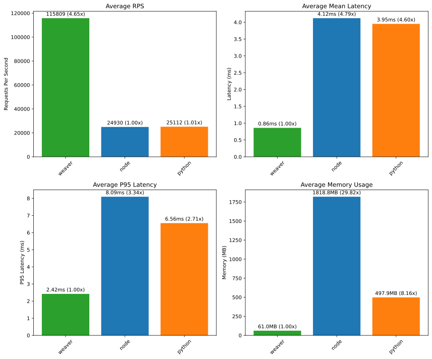
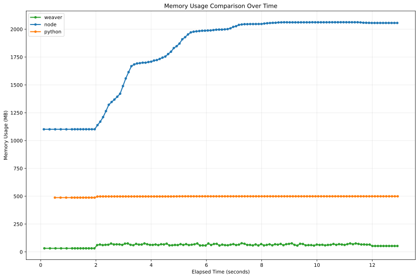
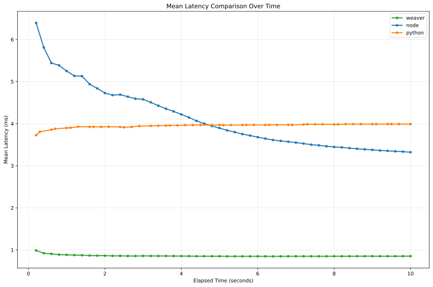
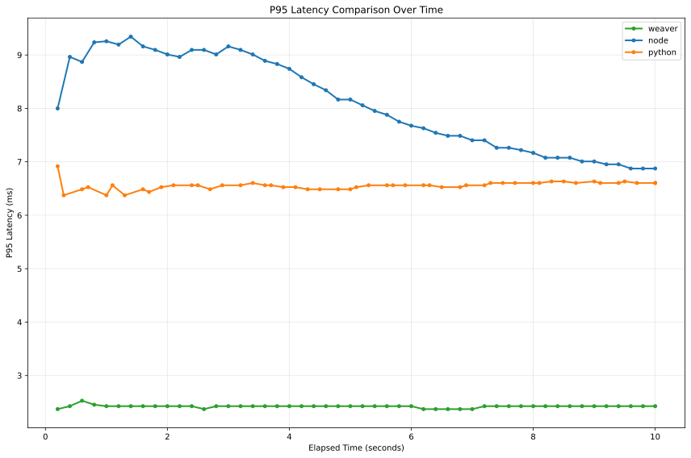
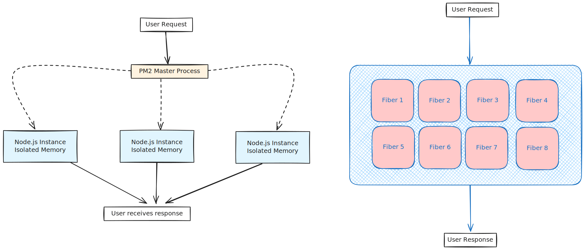

---
# You can also start simply with 'default'
theme: ./theme
# random image from a curated Unsplash collection by Anthony
# like them? see https://unsplash.com/collections/94734566/slidev
# some information about your slides (markdown enabled)
title: Weaver - A Simple Scripting Language
author: Joe Tifa
# apply unocss classes to the current slide
# https://sli.dev/features/drawing
drawings:
  persist: false
# slide transition: https://sli.dev/guide/animations.html#slide-transitions
transition: fade
# enable MDC Syntax: https://sli.dev/features/mdc
mdc: true
fonts:
  sans: 'Roboto'
  serif: 'DM Serif Text'
lineNumbers: true
remoteAssets: true
colorSchema: dark
addons:
  - slidev-component-spotlight
  - slidev-addon-excalidraw
---

# Weaver

Simple scripting language for the joy of coding.

```weaver
"Hello World!"
    |> echo()
```

---
layout: cover
---

# Overview

Weaver is a simple scripting language that prioritizes readability and simplicity.

Everything is plain objects and functions, most of the code is just concatenating functions together to solve problems.

````md magic-move {lines: true}
```weaver
arr := [1, 2, 3, 4]

echo(len(filter(arr, |n| n % 2 == 0))) // [2, 4]
```

```weaver
arr := [1, 2, 3, 4]

arr
    |> filter(|n| n % 2 == 0)
    |> len()
    |> echo() // [2, 4]
```
````

---
layout: cover
---

# Syntax

Basic syntax and feal of the language.

In this section we will cover the basics of the language, and some of the idioms that make it unique.

---
layout: cover
---

## Values

```weaver
"Hello World!"          // string
123                     // number
1.23                    // number
true                    // boolean
false                   // boolean
[1, "2", [3]]           // array
{"a": 1, "b": 2}        // object
{a: 1, b: 2}            // object (shorthand)
|a, b| a + b            // lambda
|a, b| { return a + b } // lambda
nil                     // nil (null)
```

There is only one type in Weaver that indicates the absence of a value, it is `nil`.

*Note: `{a: 1, b: 2}` is shorthand for `{"a": 1, "b": 2}`.*

---
layout: cover
---

## Binary Operations

```weaver
1 + 2             // 3     (number)
1.0 + 2           // 3.0   (number)
2.3 + 3.4         // 5.7   (number)
1 - 2             // -1    (number)
1 * 2             // 2     (number)
1 / 2             // 0.5   (number)
8 % 2             // 0     (number)

true && false     // false (boolean)
true || false     // true  (boolean)

nil || 1          // 1     (number)
error() || "foo"  // "foo" (string)

"hello " + "world" // "hello world" (string)

add := |a, b| a + b
add(1, 2)         // 3     (number)
1 |> add(2)       // 3     (number)
```

Binary operations are very familiar to other languages, with highlight be operators like pipe operator (`|>`), and lazy evaluation of binray and `&&` and `||` operators that works for booleans and other values also based on if they are "truthy" or not.

*Note: `||` returns the first "truthy" value, and `&&` returns the first "falsy" value.*

---

## Truthy Values

Weaver boolean operators work with boolean expressions `true` and `false` as well as any other value in the language.

Values that are considered "falsey" are `nil`, `error`, `false`.

<v-click>

````md magic-move {lines: true}
```weaver
// Examples of truthy and falsy values
if (true)  { echo("true is truthy!") }  // Prints
if (0)     { echo("0 is truthy!") }     // Prints
if ("")    { echo("'' is truthy!") }    // Prints
if (nil)   { echo("nil is truthy!") }   // Does not print
if (false) { echo("false is truthy!") } // Does not print

// Or operator (||) returns the first truthy value
nil || "foo"  // "foo" (string)
true || "foo" // true (boolean)

// And operator (&&) returns the first falsy value
false && "foo" // false (boolean)
nil && true    // nil
true && nil    // nil
true && "foo"  // "foo" (string)
```


```weaver
greet := |name| echo("Hello " + name);
greet("John") // Hello John
```

```weaver
greet := |name| echo("Hello " + name);
greet("John") // Hello John
greet() // Hello nil
```

```weaver
greet := |name| echo("Hello " + (name || "unknown"));
greet("John") // Hello John
greet() // Hello unknown
```

````

</v-click>

---

## Type Coercion

Weaver is dynamically typed, like the other scripting languages, but it's *strongly typed*.

There is no type coercion, so you must be explicit about the conversion of types, This is a deliberate design decision to avoid mistakes of other languages, like the enfamous JavaScript examples below.

````md magic-move
```js
// Javascript
true + false   == 1
12 / "6"       == 2
"foo" + 15 + 3 == "foo153"
{} + []        == 0
[] == ![]      == true
0 == "0"       == true
0 == []        == true
"0" == []      == false // !!!
```

```weaver
// Weaver
true + false   // ERROR! illegal operands bool + bool
12 / "6"       // ERROR! illegal operands int / string
"foo" + 15 + 3 // ERROR! illegal operands string + int
{} + []        // ERROR! illegal operands dict + array
[] == ![]      // ERROR! illegal operands array == bool
0 == "0"       // ERROR! illegal operands int == string
0 == []        // ERROR! illegal operands int == array
"0" == []      // ERROR! illegal operands string == array
```

```weaver
// Weaver
int(true) + int(false)  == 1
12 / int("6")           == 12
"foo" + string(15 + 3)  == "foo18"
```

````

<v-click>

In other words: What you see is what you get.

</v-click>

---

## Functions

Functions are first class, they can be passed around and used as values.

There are no special syntax for functions, you just assign a function value to a variable and call it.

````md magic-move {lines: true}
```weaver
add := |a, b| {
    return a + b;
}

add(1, 2)  // 3
```

```weaver
add := |a, b| a + b

add(1, 2)  // 3
```

````

<v-click>

This allows for expressive and concise code.

````md magic-move {lines: true}
```weaver
arr := [1, 2, 3, 4]

evenNumbers := []
for i := 0; i < len(arr); i++ {
    if (arr[i] % 2 == 0) {
        evenNumbers |> push(arr[i])
    }
}

echo(evenNumbers) // [2, 4]
```

```weaver
arr := [1, 2, 3, 4]
evenNumbers := filter(arr, |n| n % 2 == 0)
echo(evenNumbers) // [2, 4]
```

```weaver
arr := [1, 2, 3, 4]
echo(filter(arr, |n| n % 2 == 0)) // [2, 4]
```

```weaver
echo(filter([1, 2, 3, 4], |n| n % 2 == 0)) // [2, 4]
```

```weaver
// What if we want to read it from left to right?
echo(filter([1, 2, 3, 4], |n| n % 2 == 0)) // [2, 4]
```

```weaver
[1, 2, 3, 4] |> filter(|n| n % 2 == 0) |> echo() // [2, 4]
```
````

</v-click>

---

## Control Flow

### If Statement

```weaver
if (true) {
    echo("true is truthy!")
}

if (false) {
    echo("this will not run")
}

arr := [1, 2, 3, 4]
if (len(arr) >= 4) {
    arr[0] + arr[3] |> echo() // 5
}
```

### Ternary Operator

```weaver
n := 1
what := n % 2 == 0 ? "even" | "odd"
echo(what) // "even"
```

---

### Loops

```weaver
// prints 0 to 9
for i := 0; i < 10; i++ {
    echo(i);
}

// prints 0 to 9
for i in 0..9 {
    echo(i);
}

// prints 0 to 9
i := 0;
while (i < 10) {
    echo(i);
    i++;
}
```

---

### Match Statement

Pattern matching is a very powerful feature of Weaver, it allows you to write conditional logic based on the "shape" of the value.

Match cases are evaluated in order, from top to bottom, until a match is found.

```weaver
x := "foo"
match x {
    "bar" => echo("bar is matched"),
    "nor" => echo("nor is matched"),
    "foo" => echo("finally foo is matched"),
    _ => echo("if nothing else matches"),
}
```

```weaver
arr := [1, 2, 3, 4]
match arr {
    [1, 2] => {
        echo("arr starts with [1, 2]");
    },
    [2, 3] => {
        echo("arr starts with [2, 3]");
    },
    _ => {
        echo("otherwise");
    }
}
```

---

### Match Statement

```weaver
n := 15
match n {
    0..10 => echo("n is between 0 and 10"),
    11..20 => echo("n is between 11 and 20"),
    _ => echo("n is greater than 20"),
}
```

<v-click>

```weaver
students := [
    { name: "Youssef", gpa: 3.5 },
    { name: "John", gpa: 1.5 },
    { name: "Mahmoud", gpa: 2.0 },
];

for student in students {
    match student {
        { name, gpa: 0..1.5} => echo(name + " is good"),
        { name, gpa: 2..5} => echo(name + " is really good"),
    }
}

// output:
// Youssef is good
// John is good
// Mahmoud is really good
```

</v-click>

---

```weaver
// Match Statement Overview
match x {
    // matches string "foo"
    "foo" => {},
    // matches number 123
    123 => {},
    // matches number 1.4
    1.4 => {},
    // matches any number between 0 and 10
    0..10 => {},
    // matches any number less or equal to 10
    ..10 => {},
    // matches any number greater or equal to 5
    5.. => {},
    // matches array with at least two elements, where each element matches the pattern
    [<pattern>, <pattern>] => {},
    // matches object with "key" matching the pattern and "other" matching the pattern
    { key: <pattern>, other: <pattern> } => {},
    // matches any string and puts it in the variable s
    string(s) => {},
    // matches any number and puts it in the variable n
    number(n) => {},
    // matches error with the first pattern for the error message and the second pattern for the error details
    error(<pattern>, <pattern>) => {},
    // matches any value and puts it in the variable foo
    foo => {},
}
```

---
layout: cover
---

### Match Patterns

Patterns can be as nested as you want.

```weaver
match x {
    [1, { someArray: [a, b, c] }] if a > b && b > c => echo("MATCH!"),
    _ => echo("NO MATCH!"),
}
```

### Match Guards

Match guards are a way to add additional conditions to a match case.

```weaver
match x {
    [..10, ..10] => {},
    // same as above
    [a, b] if a <= 10 && b <= 10 => {},
}
```

---

## Error Handling

Errors are values, just like numbers or strings. When a function raises an error, it's *automatically propagated* up the call stack unless explicitly handled. This is different from languages like JavaScript that use exceptions and `try/catch` blocks.

```weaver
// Example: Automatic error propagation
divide := |a, b| {
    if (b == 0) {
      raise error("Division by zero", {divisor: b});
    }

    return a / b;
};

result := divide(10, 0)
echo(result) // This line will NOT execute
```

You can opt-out of automatic propagation using the `try` keyword:

```weaver
// Example: Opting out of automatic propagation
result := try divide(10, 0)
echo("This line WILL execute")
echo(result) // Prints the error value
```

By adding `try` before the expression (function call), we tell Weaver that we want to handle the potential error ourselves. `result` will now contain the error value.

---

We can then use pattern matching to handle the error:

```weaver
result := try divide(10, 0)
match result {
    error(msg, data) => {
        echo("Error: " + msg);                    // Prints "Division by zero"
        echo("Divisor: " + string(data.divisor)); // Prints "Divisor: 0"
    },
    n => echo("Result: " + string(n)), // This won't execute in this case
}
```

Here's a more realistic example, fetching data from a URL:

```weaver
response := try http.get("https://example.com/api/data")
match response {
    error(msg, { statusCode }) => {
        echo("HTTP request failed: " + msg);
        echo("Status code: " + string(statusCode));
    },
    res => {
        echo("Response body:")
        echo(res.body)
    }
}
```

This approach makes error handling explicit and integrates seamlessly with Weaver's pattern matching.

---
layout: cover
---
### Error Handling Example

You can also use "truthyness" to handle errors:

For example using `try/catch` in JavaScript:

```javascript
let user = null;
try {
    user = await fetchUser();
} catch (error) {
    user = { name: "Unknown" };
}
```

You can write the same thing like this in Weaver:

```weaver
user := try fetchUser() || { name: "Unknown" }
```

---

### Fibers

Weaver is a multi-threaded language, with support for non-blocking I/O operations.

You may have noticed that in the example, there is no `await` or `async` keyword, that's because Weaver is built on the notion of "Green Threads", which are lightweight threads that are managed by the runtime, and handles non-blocking IO without explicit yield points with `await`.

```javascript [JavaScript]
const buyItem = async (itemID, userID, discountID) => {
    const item = await getItem(itemID);
    const itemWithDiscount = await applyDiscount(item, discount);
    const user = await getUser(userID);
    await pay(user, itemWithDiscount);
    return itemWithDiscount;
}
```

```weaver [Weaver]
buyItem := |itemID, userID, discountID| {
    item := getItem(itemID) |> applyDiscount(discountID)
    user := getUser(userID)
    pay(user, item)
    return item
}
```

---

### Fibers

Fibers consists of: Instructions (bytecode), Data (variables and constants), and the instruction pointer (IP).

Every code in the program is running inside a fiber, code in the top level is running on the main fiber, and you can start new fibers that run concurrently with the main fiber.

<div class="grid grid-cols-2 gap-4">


```weaver
fiber := import("fiber")
io := import("io")

paths := ["foo.txt", "bar.txt"]

f1 := fiber.run(|| io.readFile(paths[0]))

f2 := fiber.run(|| io.readFile(paths[1]))

echo("main fiber")

files := fiber.wait([f1, f2])

echo(files[0]) // foo.txt
echo(files[1]) // bar.txt

// output:
// main fiber
// contents of foo.txt
// contents of bar.txt
```

<v-click>
````md magic-move {lines: true}
```weaver
fiber := import("fiber")

f1 := fiber.run(|| sleep(1000))
f2 := fiber.run(|| sleep(1000))

echo("main fiber")

// How much time to run this program?
```
```weaver
fiber := import("fiber")

f1 := fiber.run(|| sleep(1000))
f2 := fiber.run(|| sleep(1000))

echo("main fiber")

// 0ms
```

```weaver
fiber := import("fiber")

f1 := fiber.run(|| sleep(1000))
f2 := fiber.run(|| sleep(1000))

echo("main fiber")

fiber.wait([f1, f2])

// How about now?
```

```weaver
fiber := import("fiber")

f1 := fiber.run(|| sleep(1000))
f2 := fiber.run(|| sleep(1000))

echo("main fiber")

fiber.wait([f1, f2])

// 1000ms
```
````
</v-click>
</div>

---
clicks: 18
---

<Fibers />

---

### Fibers In Action, Benchmarks

A simple HTTP server with one endpoint reading a JSON file and returning a user by ID.

<div class="grid grid-cols-2 gap-2">
```weaver [Weaver]
http := import("http");
io := import("io");
json := import("json");

router := http.newRouter();

router.get("/user/{id}", |req| {
    id := req.getParam("id");
    users := io.readFile("./main.json") 
             |> json.parse();
    user := users |> find(|user| {
      return user.id == number(id)
    });

    return user;
});

echo("starting server on port 8080");
http.listenAndServe(":8080", router);
```

```javascript [JavaScript]
import express from "express";
import fs from "fs/promises";

const app = express();

app.get("/user/:id", async (req, res) => {
  const { id } = req.params
  const usersFile = await fs.readFile("./main.json")
  const users = JSON.parse(usersFile.toString())
  const user = users.find((u) => {
    return u.id === Number(id)
  });
  res.json(user)
});


console.log("Server running on port 3001");
app.listen(3001);
```
</div>

---
layout: full
---

### Fibers In Action, Benchmarks

Ran on a Lenovo Legion 5 pro with Ryzen 5 5800H (16 cores) and 32GB RAM.



---
layout: full
---

### Fibers In Action, Benchmarks

Ran on a Lenovo Legion 5 pro with Ryzen 5 5800H (16 cores) and 32GB RAM.



---
layout: full
---

### Fibers In Action, Benchmarks

Ran on a Lenovo Legion 5 pro with Ryzen 5 5800H (16 cores) and 32GB RAM.



---
layout: full
---

### Fibers In Action, Benchmarks

Ran on a Lenovo Legion 5 pro with Ryzen 5 5800H (16 cores) and 32GB RAM.



---

### Fibers In Action, Benchmarks

How are we using 16 cores while JavaScript is single threaded in this benchmark?

We are using pm2 to run the server in cluster mode, so for each of the cpu cores, we run a separate instance of the server, and then load balance the requests between them, this explains the big memory usage difference between weaver and Node.js.

On the other hand, Weaver is multi-threaded, and for each request it creates a new fiber, so it's using all the cores within a single process, and fibers share the same memory space, so the memory usage is much lower.


